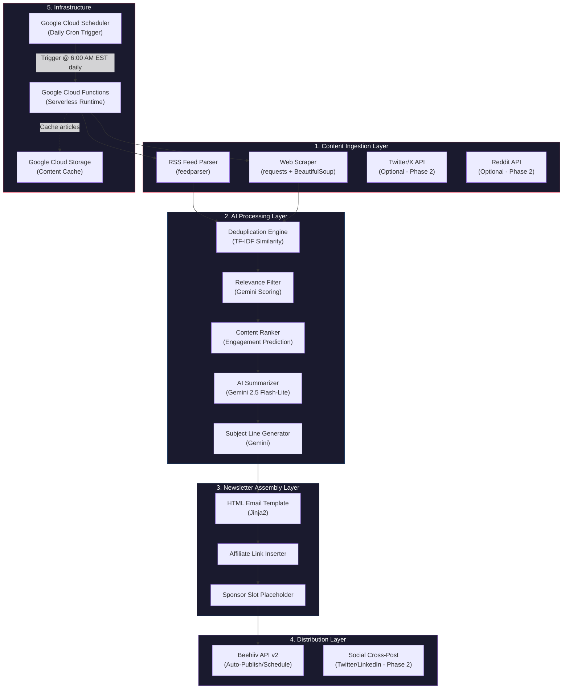
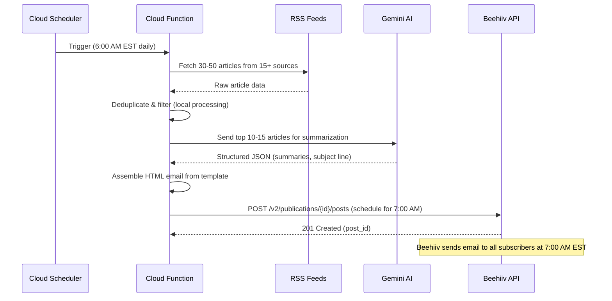
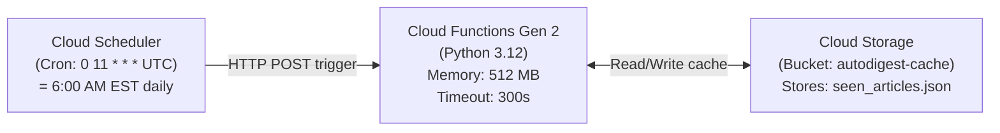
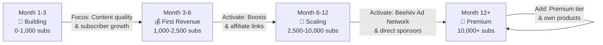
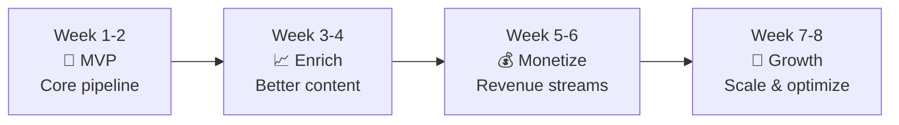

# 📋 Product Requirements Document (PRD)
# AutoDigest — Fully Automated AI Newsletter System

| Field | Detail |
|---|---|
| **Product Name** | AutoDigest |
| **Version** | 1.0 |
| **Author** | AI System Architect |
| **Date** | October 3, 2026 |
| **Status** | Draft — Awaiting User Approval |

---

## 1. Executive Summary

**AutoDigest** adalah sistem newsletter harian yang sepenuhnya diotomatisasi menggunakan AI. Sistem ini secara otomatis mengumpulkan berita/artikel dari berbagai sumber, merangkumnya menggunakan Google Gemini AI, menyusunnya menjadi email newsletter yang menarik, dan mengirimkannya ke ribuan subscriber melalui platform Beehiiv — **tanpa campur tangan manusia sama sekali** setelah setup awal.

### Goals
1. **Zero-touch daily operation** — Sistem berjalan sepenuhnya otomatis 24/7
2. **High-quality curated content** — AI menghasilkan konten setara editor profesional
3. **Zero-cost infrastructure** — Memanfaatkan free tier di semua layanan
4. **Passive income generation** — Monetisasi via sponsorship, ads, dan boosts

---

## 2. Target Audience & User Personas

### 2.1 Newsletter Owner (Kamu)
- Ingin penghasilan pasif tanpa effort harian
- Tidak perlu keahlian programming (setup 1x dibantu AI)
- Cukup memantau dashboard 1x seminggu selama 5 menit

### 2.2 Newsletter Readers (Target Subscriber)
- **Primary:** Profesional teknologi (developer, PM, designer, data scientist) usia 25-45
- **Secondary:** Founder startup, freelancer, business decision-makers
- **Geography:** Global (English-speaking markets: US, UK, EU, SEA, India)
- **Behavior:** Membuka email setiap pagi sebelum mulai kerja, mencari rangkuman cepat agar tetap update tanpa buang waktu scroll sosmed

---

## 3. Niche Selection & Analysis

### 3.1 Niche yang Dipilih: **AI Tools & Productivity**

Berdasarkan riset pasar, niche ini dipilih karena:

| Kriteria | Score | Alasan |
|---|:---:|---|
| Advertiser Demand | ⭐⭐⭐⭐⭐ | SaaS companies agresif beriklan ke tech audience |
| CPM Rate | ⭐⭐⭐⭐⭐ | \$40-60+ CPM (tertinggi kedua setelah Finance) |
| Content Availability | ⭐⭐⭐⭐⭐ | Berita AI baru setiap hari, tidak pernah kehabisan bahan |
| AI Summarization Quality | ⭐⭐⭐⭐⭐ | Gemini sangat baik merangkum konten teknologi |
| Competition | ⭐⭐⭐ | Kompetitif tapi masih ada ruang untuk diferensiasi |
| Growth Potential | ⭐⭐⭐⭐⭐ | AI adoption terus meningkat eksponensial |

### 3.2 Newsletter Identity

| Attribute | Value |
|---|---|
| **Name** | *AutoDigest* (atau pilihan kamu) |
| **Tagline** | *"Your daily 3-minute AI briefing — so you stay ahead without the scroll."* |
| **Tone** | Professional tapi approachable, concise, actionable |
| **Format** | 3-5 curated stories per edition, ~800-1200 words total |
| **Send Schedule** | Setiap hari, 7:00 AM EST (target prime inbox time untuk US market) |

### 3.3 Content Pillars (Topik Harian)

| Day | Focus Pillar | Content Type |
|---|---|---|
| Monday | 🚀 New AI Tools & Launches | Tool reviews, new releases |
| Tuesday | 💡 AI Productivity Tips | How-to, workflows, prompts |
| Wednesday | 📊 AI Industry News | Funding, acquisitions, policy |
| Thursday | 🧪 AI Research Highlights | Paper summaries, breakthroughs |
| Friday | 🏆 Weekly Roundup + Tool of the Week | Best-of compilation |
| Saturday | 📚 Deep Dive / Tutorial | In-depth guide on one topic |
| Sunday | ☕ Sunday Read + Community Picks | Lighter, curated reader suggestions |

---

## 4. System Architecture

### 4.1 High-Level Architecture Diagram



### 4.2 Execution Timeline (Single Run)



---

## 5. Tech Stack

| Layer | Technology | Justification |
|---|---|---|
| **Language** | Python 3.12+ | Rich ecosystem for scraping, AI, API integration |
| **AI Model** | Gemini 2.5 Flash-Lite | Best cost/performance: \$0.10/1M input, \$0.40/1M output tokens. Free tier: 1,500 RPD |
| **Newsletter Platform** | Beehiiv (Free tier) | Official REST API, auto-publish/schedule, 2,500 free subscribers, built-in monetization |
| **RSS Parsing** | `feedparser` | Industry standard, handles all RSS/Atom formats |
| **Web Scraping** | `requests` + `beautifulsoup4` | Lightweight, no browser needed for article extraction |
| **Article Extraction** | `newspaper3k` atau `trafilatura` | Extracts clean article text from any URL |
| **HTML Templating** | `jinja2` | Powerful template engine for email HTML |
| **HTTP Client** | `httpx` | Modern async HTTP client for API calls |
| **Structured Output** | `pydantic` | Type-safe data models, native Gemini JSON schema support |
| **Deployment** | Google Cloud Functions (Gen 2) | Serverless, 2M free invocations/month |
| **Scheduling** | Google Cloud Scheduler | 3 free cron jobs/billing account |
| **Storage** | Google Cloud Storage | Cache processed articles to prevent duplicates |
| **Logging** | Google Cloud Logging | Built-in with Cloud Functions |

---

## 6. Feature Requirements (Phased)

### Phase 1 — MVP (Week 1-2): Core Pipeline
> Tujuan: Newsletter harian yang berfungsi end-to-end

| ID | Feature | Priority | Description |
|---|---|:---:|---|
| F1.1 | RSS Feed Ingestion | P0 | Parse 15+ tech/AI RSS feeds, extract title + URL + content |
| F1.2 | Article Text Extraction | P0 | Extract clean article body from URLs using `trafilatura` |
| F1.3 | Content Deduplication | P0 | Skip articles already covered in previous editions (hash-based) |
| F1.4 | AI Content Curation | P0 | Gemini scores & ranks articles by relevance and newsworthiness |
| F1.5 | AI Summarization | P0 | Generate 2-3 sentence summaries + key takeaways per article |
| F1.6 | Subject Line Generation | P0 | AI generates high-CTR email subject lines |
| F1.7 | HTML Email Assembly | P0 | Jinja2 template produces clean, responsive email HTML |
| F1.8 | Beehiiv Auto-Publish | P0 | POST to Beehiiv API with scheduled send time |
| F1.9 | Error Handling & Retry | P0 | Graceful degradation if sources fail; exponential backoff |
| F1.10 | Cloud Function Deployment | P0 | Deploy to GCF with Cloud Scheduler trigger |

---

### Phase 2 — Content Enrichment (Week 3-4): Better Content
> Tujuan: Konten lebih kaya, lebih engaging

| ID | Feature | Priority | Description |
|---|---|:---:|---|
| F2.1 | Content Pillars System | P1 | Different content focus per day of week |
| F2.2 | Additional Sources | P1 | Add Twitter/X trending, Reddit, Hacker News, Product Hunt |
| F2.3 | "Tool of the Day" Section | P1 | Auto-discover and feature new AI tools |
| F2.4 | Engagement Hooks | P1 | Add polls, questions, or "reply to share your take" CTA |
| F2.5 | A/B Subject Lines | P1 | Generate 2 subject lines, let Beehiiv A/B test |
| F2.6 | Content Quality Guard | P1 | Secondary AI pass to verify factual accuracy and tone |

---

### Phase 3 — Monetization (Week 5-6): Revenue Activation
> Tujuan: Mulai menghasilkan uang

| ID | Feature | Priority | Description |
|---|---|:---:|---|
| F3.1 | Affiliate Link Injection | P1 | Auto-detect product mentions, insert affiliate links |
| F3.2 | Sponsor Slot Template | P1 | Reserved HTML block for ad insertion |
| F3.3 | Beehiiv Boosts Integration | P2 | Participate in the Boosts recommendation marketplace |
| F3.4 | Referral Program Setup | P2 | Configure Beehiiv's built-in referral rewards |

---

### Phase 4 — Growth & Optimization (Week 7-8): Scale
> Tujuan: Akselerasi subscriber growth

| ID | Feature | Priority | Description |
|---|---|:---:|---|
| F4.1 | Social Media Cross-Post | P2 | Auto-post newsletter highlights to Twitter/X, LinkedIn |
| F4.2 | SEO Landing Pages | P2 | Each newsletter edition published as web article (Beehiiv auto) |
| F4.3 | Analytics Dashboard | P2 | Weekly email report of subscriber growth, open rates, revenue |
| F4.4 | Welcome Email Automation | P2 | Beehiiv automation sequence for new subscribers |
| F4.5 | Content Performance Tracking | P3 | Track which topics get highest engagement, auto-adjust |

---

## 7. Detailed Data Flow & Pipeline

### 7.1 Content Source Registry (RSS Feeds)

Sumber konten awal yang akan di-scrape setiap hari:

| # | Source | Feed URL | Category |
|---|---|---|---|
| 1 | TechCrunch AI | `https://techcrunch.com/category/artificial-intelligence/feed/` | News |
| 2 | The Verge AI | `https://www.theverge.com/rss/ai-artificial-intelligence/index.xml` | News |
| 3 | MIT Technology Review | `https://www.technologyreview.com/feed/` | Research |
| 4 | Ars Technica AI | `https://feeds.arstechnica.com/arstechnica/technology-lab` | News |
| 5 | VentureBeat AI | `https://venturebeat.com/category/ai/feed/` | Business |
| 6 | Hacker News (Top) | `https://hnrss.org/best?count=30` | Community |
| 7 | Product Hunt (Tech) | `https://www.producthunt.com/feed` | Tools |
| 8 | OpenAI Blog | `https://openai.com/blog/rss/` | Research |
| 9 | Google AI Blog | `https://blog.google/technology/ai/rss/` | Research |
| 10 | Anthropic Blog | `https://www.anthropic.com/rss.xml` | Research |
| 11 | Hugging Face Blog | `https://huggingface.co/blog/feed.xml` | Research |
| 12 | Ben's Bites (RSS) | `https://bensbites.beehiiv.com/feed` | Curation |
| 13 | The Rundown AI (RSS) | `https://www.therundown.ai/feed` | Curation |
| 14 | TLDR AI | `https://tldr.tech/ai/rss` | Curation |
| 15 | ArXiv CS.AI (top) | `https://rss.arxiv.org/rss/cs.AI` | Academic |

> [!NOTE]
> RSS feed URLs akan diverifikasi dan diupdate saat implementasi. Beberapa mungkin berubah atau tidak tersedia.

### 7.2 AI Processing Pipeline Detail

```python
# Pseudocode — Alur pemrosesan AI

# Step 1: Fetch & Extract
raw_articles: list[RawArticle] = fetch_all_rss_feeds(FEED_REGISTRY)
# Output: ~30-50 articles with title, url, published_date, raw_text

# Step 2: Deduplicate
unique_articles = deduplicate(
    new_articles=raw_articles,
    seen_hashes=load_from_gcs("seen_articles.json"),  # Previous editions
    similarity_threshold=0.85
)
# Output: ~20-35 unique articles

# Step 3: AI Relevance Scoring & Ranking
ranked_articles = gemini_score_and_rank(
    articles=unique_articles,
    criteria={
        "relevance": "How relevant is this to AI professionals?",
        "newsworthiness": "Is this breaking news or significant?",
        "actionability": "Can readers immediately benefit from this?",
        "uniqueness": "Is this a unique angle not covered elsewhere?"
    },
    model="gemini-2.5-flash-lite",
    top_k=5  # Select top 5 articles
)
# Output: Top 5 articles with relevance scores

# Step 4: AI Summarization (Structured Output)
newsletter_digest: NewsletterDigest = gemini_summarize(
    articles=ranked_articles,
    output_schema=NewsletterDigest,  # Pydantic model
    model="gemini-2.5-flash-lite",
    instructions=EDITORIAL_SYSTEM_PROMPT
)
# Output: Structured JSON with summaries, subject line, intro, conclusion

# Step 5: Assemble & Publish
html_email = render_template("newsletter.html.j2", digest=newsletter_digest)
beehiiv_publish(html=html_email, scheduled_at="07:00 EST")
```

### 7.3 Pydantic Data Models

```python
from pydantic import BaseModel, Field
from datetime import datetime

class RawArticle(BaseModel):
    """Raw article fetched from RSS feed."""
    title: str
    url: str
    source: str
    published_at: datetime
    raw_text: str
    content_hash: str  # For deduplication

class ArticleSummary(BaseModel):
    """AI-generated summary for one article."""
    headline: str = Field(description="Catchy 8-12 word headline")
    emoji: str = Field(description="Single relevant emoji")
    source_name: str = Field(description="Original publication name")
    source_url: str = Field(description="Link to original article")
    summary: str = Field(description="2-3 sentence summary of core insight")
    key_takeaways: list[str] = Field(
        description="2-3 bullet points of crucial facts",
        min_length=2, max_length=3
    )
    relevance_score: int = Field(
        description="Relevance score 1-10",
        ge=1, le=10
    )

class NewsletterDigest(BaseModel):
    """Complete newsletter edition output from AI."""
    subject_line: str = Field(description="High open-rate email subject line, max 60 chars")
    preview_text: str = Field(description="Email preview text, max 120 chars")
    greeting: str = Field(description="Brief engaging opening, 1-2 sentences")
    articles: list[ArticleSummary] = Field(
        description="3-5 curated article summaries",
        min_length=3, max_length=5
    )
    tool_of_the_day: ArticleSummary | None = Field(
        description="Featured AI tool recommendation",
        default=None
    )
    closing: str = Field(description="Sign-off with CTA to share/reply, 1-2 sentences")
    edition_number: int
    publish_date: str
```

---

## 8. API Integration Specifications

### 8.1 Beehiiv API Integration

**Base URL:** `https://api.beehiiv.com/v2/`

**Authentication:**
```http
Authorization: Bearer <BEEHIIV_API_KEY>
```

**Core Endpoint — Create & Schedule Post:**
```
POST /v2/publications/{publication_id}/posts
```

**Request Body:**
```json
{
  "title": "🤖 5 AI Tools That Will Save You 3 Hours Today",
  "subtitle": "Plus: OpenAI's surprise announcement and why it matters",
  "status": "confirmed",
  "scheduled_at": "2026-10-04T12:00:00Z",
  "body_content": "<html>...</html>",
  "audience_type": "free"
}
```

**Rate Limits (Free Tier):** 30 req/min (more than sufficient — we make 1-2 requests per day)

**Key Endpoints Used:**

| Endpoint | Method | Purpose |
|---|---|---|
| `/v2/publications/{id}/posts` | POST | Create & schedule newsletter |
| `/v2/publications/{id}/posts/{post_id}` | GET | Verify post was created successfully |
| `/v2/publications/{id}/subscriptions` | GET | Monitor subscriber count |
| `/v2/publications/{id}/posts/aggregate_stats` | GET | Weekly analytics check |

### 8.2 Gemini API Integration

**SDK:** `google-genai` (Python)

**Model:** `gemini-2.5-flash-lite`

**Authentication:**
```python
import os
from google import genai

client = genai.Client()  # Reads GEMINI_API_KEY from env
```

**Key Configuration:**
```python
from google.genai import types

config = types.GenerateContentConfig(
    system_instruction=EDITORIAL_SYSTEM_PROMPT,
    response_mime_type="application/json",
    response_json_schema=NewsletterDigest.model_json_schema(),
    temperature=0.3,  # Low temp for factual accuracy
)
```

**Cost Estimation per Day (Free Tier):**

| Operation | Input Tokens | Output Tokens | Cost |
|---|---|---|---|
| Score 30 articles (~500 words each) | ~20,000 | ~3,000 | FREE |
| Summarize top 5 articles (~2000 words each) | ~15,000 | ~5,000 | FREE |
| Generate subject line + intro + closing | ~1,000 | ~500 | FREE |
| **Daily Total** | **~36,000** | **~8,500** | **\$0.00** |
| **Monthly Total (30 days)** | **~1,080,000** | **~255,000** | **\$0.00** |

> [!TIP]
> Gemini Free Tier memberikan **1,500 requests/day** dan **1,000,000 tokens/minute**. Newsletter kita hanya membutuhkan **2-3 requests/day** dan **~45,000 tokens/day** — jauh di bawah limit. **Biaya AI: \$0/bulan.**

---

## 9. Email Template Design Specification

### 9.1 Email Structure

```
┌─────────────────────────────────────┐
│          HEADER / LOGO              │
│   "AutoDigest — Your Daily AI Fix"  │
├─────────────────────────────────────┤
│         GREETING / INTRO            │
│  "Good morning! Here's your daily   │
│   AI briefing in under 3 minutes."  │
├─────────────────────────────────────┤
│                                     │
│   📰 ARTICLE 1 — HEADLINE          │
│   Source: TechCrunch                │
│   Summary text...                   │
│   • Key takeaway 1                  │
│   • Key takeaway 2                  │
│   [Read full article →]             │
│                                     │
│   ─────────────────────────         │
│                                     │
│   🚀 ARTICLE 2 — HEADLINE          │
│   Source: The Verge                 │
│   Summary text...                   │
│   • Key takeaway 1                  │
│   • Key takeaway 2                  │
│   [Read full article →]             │
│                                     │
│   ─────────────────────────         │
│                                     │
│   (... 3-5 articles total ...)      │
│                                     │
├─────────────────────────────────────┤
│    💎 [SPONSOR SLOT] (Phase 3)      │
│    "Brought to you by {Brand}"      │
├─────────────────────────────────────┤
│   🛠️ TOOL OF THE DAY               │
│   Tool name + description + link    │
├─────────────────────────────────────┤
│         CLOSING / CTA               │
│  "Enjoyed this? Share with a        │
│   colleague → [Share Link]"         │
│                                     │
│   📊 "Was today's edition useful?"  │
│   [👍 Yes]  [👎 No]  [🔥 Loved it] │
├─────────────────────────────────────┤
│           FOOTER                    │
│   Unsubscribe | View in browser     │
│   © 2026 AutoDigest                 │
└─────────────────────────────────────┘
```

### 9.2 Design Principles
- **Mobile-first responsive** (70%+ email opens are on mobile)
- **Single-column layout** (max 600px width)
- **System fonts** (Arial/Helvetica — universal email compatibility)
- **Dark/light mode compatible** (transparent backgrounds, adaptive colors)
- **Inline CSS only** (email clients strip `<style>` tags)
- **No images in MVP** (faster load, better deliverability, simpler automation)

---

## 10. Deployment Architecture

### 10.1 Google Cloud Functions Setup



**Cloud Scheduler Cron Expression:**
```
0 11 * * *
```
*(11:00 UTC = 6:00 AM EST — gives 1 hour buffer before 7 AM send)*

**Cloud Function Configuration:**
```yaml
runtime: python312
memory: 512MB
timeout: 300s     # 5 minutes max execution
max_instances: 1  # Prevent concurrent runs
min_instances: 0  # Scale to zero when idle
```

### 10.2 Environment Variables (Secrets)

| Variable | Description | Source |
|---|---|---|
| `GEMINI_API_KEY` | Google AI Studio API key | [aistudio.google.com](https://aistudio.google.com) |
| `BEEHIIV_API_KEY` | Beehiiv REST API bearer token | Beehiiv Dashboard > Settings > API |
| `BEEHIIV_PUBLICATION_ID` | Publication identifier | Beehiiv Dashboard > Settings |
| `GCS_BUCKET_NAME` | Cloud Storage bucket for caching | GCP Console |

> [!IMPORTANT]
> Semua secrets disimpan di **Google Cloud Secret Manager** (gratis untuk 6 secrets), BUKAN sebagai plaintext environment variables.

### 10.3 Free Tier Budget Analysis

| Service | Free Tier Allowance | Our Usage | Utilization |
|---|---|---|---|
| **Cloud Functions** | 2,000,000 invocations/month | ~30 invocations/month | **0.0015%** |
| **Cloud Functions Compute** | 400,000 GB-seconds/month | ~150 GB-seconds/month (0.5GB × 300s × 30) | **0.04%** |
| **Cloud Scheduler** | 3 jobs/billing account | 1 job | **33%** |
| **Cloud Storage** | 5 GB | < 1 MB | **~0%** |
| **Gemini API** | 1,500 req/day | 2-3 req/day | **0.2%** |
| **Beehiiv** | 2,500 subscribers | 0 → 2,500 | Scales with growth |
| **Secret Manager** | 6 secret versions | 4 secrets | **67%** |

> [!TIP]
> **Total monthly infrastructure cost: \$0.00** — Semua layanan beroperasi jauh di bawah free tier limits.

---

## 11. Cost Analysis

### 11.1 Startup Costs (One-Time)

| Item | Cost | Notes |
|---|---|---|
| Domain name (optional) | \$10-15/year | e.g., `autodigest.email` via Namecheap/Cloudflare |
| Beehiiv custom domain setup | \$0 (Free tier) | Custom domain included free |
| Google Cloud account | \$0 | Free tier, no credit card needed for most services |
| **Total startup** | **\$0 — \$15** | |

### 11.2 Monthly Operating Costs

| Item | Phase 1 (0-2,500 subs) | Phase 2 (2,500-10,000 subs) |
|---|---|---|
| Beehiiv | \$0 (Free) | ~\$49/month (Lite plan) |
| Gemini API | \$0 (Free tier) | \$0 (still within free tier) |
| Cloud Functions | \$0 (Free tier) | \$0 (still within free tier) |
| Cloud Scheduler | \$0 (Free tier) | \$0 (still within free tier) |
| **Total monthly** | **\$0/month** | **~\$49/month** |

### 11.3 Revenue vs Cost Projection

| Subscriber Count | Monthly Revenue (Est.) | Monthly Cost | Net Profit |
|---:|---:|---:|---:|
| 500 | \$0 (building audience) | \$0 | \$0 |
| 1,000 | \$50-100 (Boosts referral) | \$0 | \$50-100 |
| 2,500 | \$200-400 (Boosts + early sponsors) | \$0 | \$200-400 |
| 5,000 | \$500-1,500 (Ad Network + sponsors) | \$49 | \$451-1,451 |
| 10,000 | \$1,500-4,000 (Premium sponsors) | \$49 | \$1,451-3,951 |
| 25,000 | \$4,000-10,000 | \$99 | \$3,901-9,901 |

---

## 12. Monetization Strategy

### 12.1 Revenue Streams (Prioritized by Timeline)



### 12.2 Revenue Channel Detail

| Channel | When to Activate | Expected Revenue | Effort |
|---|---|---|---|
| **Beehiiv Boosts** | 500+ subscribers | \$1-3 per referred subscriber | Zero effort (automated) |
| **Affiliate Links** | From day 1 | 5-30% commission per sale | Auto-inserted by AI |
| **Beehiiv Ad Network** | 1,000+ subs + paid plan | \$30-60 CPM | Low effort (accept/reject offers) |
| **Direct Sponsorships** | 5,000+ subs | \$200-500 per placement | Medium (respond to inquiries) |
| **Paid Premium Tier** | 10,000+ subs | \$5-10/month per paid sub | Low (gate some content) |

---

## 13. Growth Strategy

### 13.1 Subscriber Acquisition Channels

| Channel | Strategy | Expected Impact |
|---|---|---|
| **Beehiiv Boosts (Paid Acquisition)** | Set CPA budget to acquire subscribers from other newsletters | High — targeted, verified subscribers |
| **Twitter/X Cross-Posting** | Auto-post 1 key insight from each edition as a thread/post | Medium — organic discovery |
| **LinkedIn Cross-Posting** | Share professional insights from newsletter | Medium — B2B audience |
| **SEO (Web Archive)** | Beehiiv auto-publishes each edition as a web page, indexable by Google | Long-term — compounding traffic |
| **Referral Program** | "Refer 3 friends, get exclusive AI prompt pack" | Medium — viral growth |
| **Reddit / Hacker News** | Share genuinely valuable content (not spam) | Low-Medium — community driven |

### 13.2 Growth Targets

| Month | Target Subscribers | Daily Growth Rate |
|---|---:|---|
| Month 1 | 100-300 | 3-10/day |
| Month 3 | 500-1,000 | 5-20/day |
| Month 6 | 2,000-3,000 | 10-30/day |
| Month 12 | 5,000-10,000 | 15-50/day |

---

## 14. Success Metrics & KPIs

| Metric | Target | Measurement |
|---|---|---|
| **Open Rate** | > 40% (industry avg: 30-35%) | Beehiiv analytics |
| **Click-Through Rate (CTR)** | > 5% | Beehiiv analytics |
| **Subscriber Growth Rate** | > 10% month-over-month | Beehiiv subscriber count |
| **Unsubscribe Rate** | < 0.5% per edition | Beehiiv analytics |
| **System Uptime** | > 99% (miss < 4 editions/year) | Cloud Function logs |
| **Content Quality Score** | > 4/5 (reader polls) | In-email feedback buttons |
| **Revenue per Subscriber** | > \$0.50/month at 5,000+ subs | Revenue / subscriber count |
| **Time Spent by Owner** | < 30 min/week | Self-reported |

---

## 15. Risk Analysis & Mitigation

| Risk | Probability | Impact | Mitigation |
|---|:---:|:---:|---|
| **Gemini API free tier removed/reduced** | Low | High | Fallback to Gemini 2.5 Flash-Lite paid (cost: ~\$0.05/day). Budget impact: negligible |
| **Beehiiv free tier reduced** | Low | Medium | Migrate to Buttondown (free API, 100 subs) or self-hosted Ghost |
| **Content detected as AI-generated** | Medium | Medium | Editorial system prompt emphasizes unique voice; human review option |
| **RSS feeds change/break** | Medium | Low | Multiple redundant sources; error handling skips broken feeds |
| **Low open rates** | Medium | Medium | A/B test subject lines; segment audience; optimize send time |
| **Spam folder delivery** | Low | High | Beehiiv handles deliverability; custom domain with DKIM/SPF/DMARC |
| **Google Cloud billing surprise** | Low | Medium | Set budget alerts at \$1; use only free-tier-eligible services |
| **Copyright concerns** | Low | Medium | Only publish summaries (fair use), always link to original source |

---

## 16. Implementation Timeline



| Week | Deliverables |
|---|---|
| **Week 1** | Project setup, RSS parser, article extractor, Gemini integration, Pydantic models |
| **Week 2** | HTML email template, Beehiiv API integration, Cloud Function deployment, Cloud Scheduler setup, end-to-end test |
| **Week 3** | Content pillars system, additional sources, "Tool of the Day" feature |
| **Week 4** | A/B subject lines, content quality guard, engagement hooks |
| **Week 5** | Affiliate link injection system, sponsor slot template |
| **Week 6** | Beehiiv Boosts setup, referral program configuration |
| **Week 7** | Social media cross-posting bot (Twitter/X, LinkedIn) |
| **Week 8** | Analytics dashboard, performance tracking, optimization tuning |

---

## 17. Project File Structure

```
autodigest/
├── README.md                      # Project documentation
├── requirements.txt               # Python dependencies
├── pyproject.toml                 # Project metadata
│
├── src/
│   ├── __init__.py
│   ├── main.py                    # Cloud Function entry point
│   ├── config.py                  # Configuration & environment variables
│   │
│   ├── ingestion/                 # Content Ingestion Layer
│   │   ├── __init__.py
│   │   ├── rss_fetcher.py         # RSS feed parser
│   │   ├── article_extractor.py   # Full article text extraction
│   │   ├── deduplicator.py        # Content deduplication logic
│   │   └── feed_registry.py       # RSS feed URL registry
│   │
│   ├── ai/                        # AI Processing Layer
│   │   ├── __init__.py
│   │   ├── gemini_client.py       # Gemini API wrapper
│   │   ├── content_scorer.py      # Article relevance scoring
│   │   ├── summarizer.py          # Article summarization
│   │   ├── subject_generator.py   # Email subject line generation
│   │   └── prompts.py             # System prompts & templates
│   │
│   ├── assembly/                  # Newsletter Assembly Layer
│   │   ├── __init__.py
│   │   ├── template_engine.py     # Jinja2 HTML email assembly
│   │   ├── affiliate_injector.py  # Affiliate link insertion
│   │   └── sponsor_slot.py        # Sponsor placeholder management
│   │
│   ├── distribution/              # Distribution Layer
│   │   ├── __init__.py
│   │   ├── beehiiv_client.py      # Beehiiv API client
│   │   └── social_poster.py       # Cross-platform posting (Phase 2)
│   │
│   ├── storage/                   # Data Persistence
│   │   ├── __init__.py
│   │   └── gcs_cache.py           # Google Cloud Storage cache
│   │
│   └── models/                    # Data Models
│       ├── __init__.py
│       └── schemas.py             # Pydantic schemas
│
├── templates/
│   └── newsletter.html.j2         # Jinja2 email template
│
├── tests/
│   ├── __init__.py
│   ├── test_rss_fetcher.py
│   ├── test_summarizer.py
│   ├── test_beehiiv_client.py
│   └── test_pipeline.py           # End-to-end pipeline test
│
├── scripts/
│   ├── deploy.sh                  # GCF deployment script
│   ├── test_local.py              # Local testing script
│   └── setup_gcp.sh               # GCP resource provisioning
│
└── .env.example                   # Environment variable template
```

---

## 18. Verification Plan

### 18.1 Automated Tests

```bash
# Unit tests
pytest tests/ -v

# End-to-end local test (generates newsletter without sending)
python scripts/test_local.py --dry-run

# End-to-end test with Beehiiv (creates draft, doesn't send)
python scripts/test_local.py --draft-only
```

### 18.2 Manual Verification Checklist

| Step | Verification | How |
|---|---|---|
| 1 | RSS feeds return data | Run `test_local.py`, check article count > 0 |
| 2 | Gemini generates valid JSON | Check structured output matches Pydantic schema |
| 3 | HTML email renders correctly | Open generated HTML in browser, test mobile view |
| 4 | Beehiiv draft created | Check Beehiiv dashboard for new draft post |
| 5 | Scheduled send works | Schedule test post 5 min in future, verify delivery |
| 6 | Cloud Function deploys | `gcloud functions deploy` succeeds |
| 7 | Cloud Scheduler triggers | Check Cloud Function logs after scheduled time |
| 8 | Full pipeline completes < 5 min | Check Cloud Function execution time in logs |
| 9 | No duplicate articles | Run pipeline 2x, verify no repeated content |
| 10 | Error handling works | Disconnect internet mid-run, verify graceful failure |

---

## 19. Open Questions

> [!IMPORTANT]
> **Keputusan yang perlu kamu ambil sebelum implementasi dimulai:**

1. **Nama Newsletter:** Apakah "AutoDigest" sudah oke, atau kamu punya nama lain yang lebih kamu suka?

2. **Niche Konfirmasi:** Saya merekomendasikan **"AI Tools & Productivity"** berdasarkan riset. Apakah kamu setuju, atau ingin niche yang berbeda?

3. **Google Cloud Account:** Apakah kamu sudah punya Google Cloud account? Jika belum, kamu perlu membuat satu (gratis, tapi butuh kartu kredit/debit untuk verifikasi — tidak akan dicharge selama di free tier).

4. **Gemini API Key:** Apakah kamu sudah punya API key dari [Google AI Studio](https://aistudio.google.com)?

5. **Send Time:** Saya merekomendasikan **7:00 AM EST** (8:00 PM WIB) untuk target audiens US. Apakah kamu setuju?

6. **Beehiiv vs Alternatives:** Saya memilih Beehiiv karena API-nya paling mature dan monetisasi built-in. Alternatif: **Buttondown** (lebih developer-friendly, 100 free subs) atau **Ghost** (self-hosted, unlimited, tapi butuh server). Apakah Beehiiv oke?

---

## 20. Approval Gate

> [!CAUTION]
> **Dokumen ini memerlukan persetujuan kamu sebelum implementasi dimulai.**
>
> Setelah kamu review dan approve, saya akan langsung mulai coding dari Phase 1 (MVP) sesuai timeline di atas.
>
> Silakan review dan berikan feedback. Kamu bisa meminta perubahan pada bagian mana pun dari dokumen ini.
